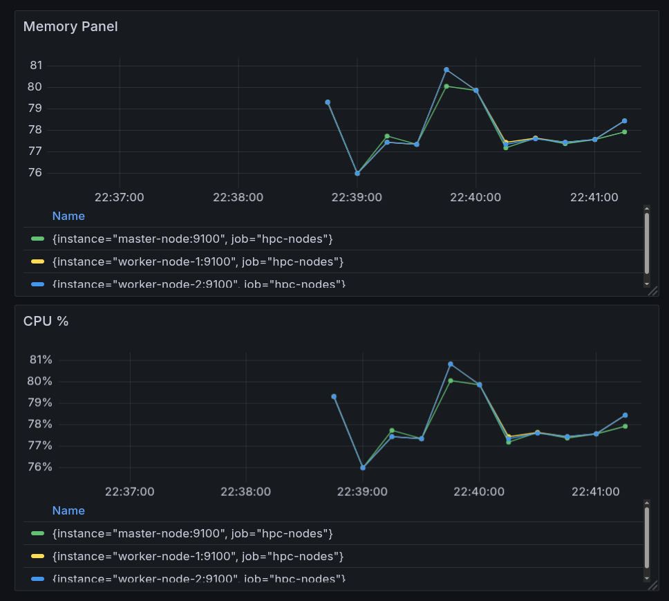

# Mini HPC Cluster Simulation

<p align="center">
  <strong>A Docker-based High-Performance Computing environment for learning distributed computing, fault tolerance, and cluster monitoring.</strong>
</p>

<p align="center">
  
  
  
  
</p>

---

## 🎯 Overview

Mini HPC simulates a production-grade HPC cluster with automatic fault recovery, real-time monitoring, and distributed job execution. Perfect for learning distributed systems, container orchestration, and observability patterns.

### Key Features

| Feature | Description |
|---------|-------------|
| 🏗️ **Distributed Architecture** | 1 master + 2 worker nodes with Docker networking |
| 🔄 **Fault Tolerance** | Auto-restart policies, health checks, recovery monitoring |
| 📊 **Observability** | Prometheus metrics + Grafana dashboards |
| 🚀 **Job Management** | Queue system with logging and distributed execution |
| 🤖 **ML Support** | Distributed PyTorch training with Gloo backend |
| ⚡ **Easy Operations** | Makefile commands for all cluster operations |

---

## 🚀 Quick Start

```bash
# Clone and setup
git clone https://github.com/faraz-irshad/mini-hpc-cluster.git
cd mini-hpc-cluster

# Install dependencies
pip install -r requirements.txt

# Build and start cluster
make build
make up

# Submit your first job
make submit

# Check cluster health
make health
```

**Access dashboards:**
- Prometheus: http://localhost:9090
- Grafana: http://localhost:3000 (admin/admin)

---

## 📋 Prerequisites

- **Docker** (v20.10+) & **Docker Compose** (v2.0+)
- **Python 3.8+**
- **Linux/macOS** (tested on Pop!_OS/Ubuntu)
- **4GB RAM** minimum (8GB recommended)

---

## 🎮 Command Reference

### Cluster Operations

```bash
make build          # Build Docker images
make up             # Start cluster (detached mode)
make down           # Stop cluster
make status         # Show container status
make clean          # Remove containers, volumes, and logs
```

### Job Management

```bash
make submit         # Submit jobs from jobs/ directory
make logs           # View job execution logs
make monitor        # Real-time job monitoring (updates every 2s)
```

### Fault Tolerance

```bash
make health         # Check cluster health status
make test-failure   # Simulate node failure (interactive)
make watch-recovery # Monitor recovery in real-time (updates every 5s)
```

### Advanced

```bash
# Manual job submission
python3 submit_job.py

# Direct failure simulation
python3 simulate_failure.py worker-node-1

# Health check
python3 recovery_monitor.py

# Restart strategies
make down && make up                    # Quick restart
make clean && make build && make up     # Full rebuild
```

---

## 📁 Project Structure

```
mini-hpc/
├── 📂 jobs/                          # Job scripts directory
│   ├── hello.py                     # Simple test job
│   ├── benchmark.py                 # Performance benchmark
│   └── train_mnist_distributed.py   # Distributed PyTorch training
│
├── 📂 logs/                          # Job execution logs (auto-generated)
├── 📂 screenshots/                   # Dashboard screenshots
│
├── 🐳 Dockerfile                     # Container image definition
├── 🐳 docker-compose.yml             # Cluster orchestration
│
├── 📊 prometheus.yml                 # Metrics collection config
├── 🔧 metrics_exporter.py            # Custom metrics exporter
│
├── 🚀 submit_job.py                  # Job submission interface
├── 📋 job_queue.py                   # Job queue management
├── 👁️ monitor_jobs.py                # Job monitoring tool
│
├── 🔄 simulate_failure.py            # Fault tolerance testing
├── 💚 recovery_monitor.py            # Health & recovery monitoring
│
├── 🛠️ setup_grafana.sh               # Grafana dashboard setup
├── ⚙️ Makefile                       # Command shortcuts
├── 📦 requirements.txt               # Python dependencies
│
├── 📖 README.md                      # This file
├── 📖 FAULT_TOLERANCE.md             # Fault tolerance guide
└── 📖 METRICS_GUIDE.md               # Metrics documentation
```

---

## 💼 Working with Jobs

### Creating Jobs

1. Create a Python script in the `jobs/` directory:

```python
# jobs/my_custom_job.py
import os
import time

node = os.uname().nodename
rank = os.environ.get("RANK", "0")

print(f"[Rank {rank}] Starting job on {node}")
time.sleep(2)
print(f"[Rank {rank}] Job completed successfully!")
```

2. Submit the job:

```bash
make submit
```

3. View logs:

```bash
make logs                              # Interactive monitoring
cat logs/worker-node-1_my_custom_job.log  # Direct log access
```

### Example Jobs

**Simple Hello World** (`hello.py`)
```python
import os
rank = os.environ.get("RANK", "0")
node = os.uname().nodename
print(f"[Rank {rank}] Hello from {node}!")
```

**Performance Benchmark** (`benchmark.py`)
```bash
make submit  # Runs CPU/memory benchmarks across all nodes
```

**Distributed ML Training** (`train_mnist_distributed.py`)
```bash
make submit  # Distributed PyTorch training with Gloo backend
```

---

## 📊 Monitoring & Observability

### Dashboards

| Service | URL | Credentials |
|---------|-----|-------------|
| **Prometheus** | http://localhost:9090 | None |
| **Grafana** | http://localhost:3000 | admin/admin |

### Available Metrics

```promql
# CPU usage per node
node_cpu_percent

# Memory usage percentage  
node_memory_percent

# Memory used (GB)
node_memory_MemUsed_bytes / 1024 / 1024 / 1024

# Disk I/O
node_disk_io_time_seconds_total
```

### Live Dashboard



*Real-time CPU and memory metrics across all nodes during distributed job execution.*

### Log Files

- **Job logs:** `logs/<node>_<job>.log`
- **Cluster log:** `hpc_cluster.log`
- **Container logs:** `docker logs <container-name>`

---

## 🔄 Fault Tolerance & Recovery

### Automatic Recovery Features

- **Auto-restart policies:** Containers restart automatically on failure
- **Health checks:** 30-second intervals with 3 retries
- **Recovery monitoring:** Real-time status tracking
- **Graceful degradation:** Cluster continues with available nodes

### Testing Fault Tolerance

```bash
# Check current cluster health
make health

# Simulate node failure (interactive)
make test-failure
# Choose: master-node, worker-node-1, or worker-node-2

# Direct failure simulation
python3 simulate_failure.py worker-node-1

# Watch recovery process
make watch-recovery
```

### Recovery Process

1. **Failure detected** → Health check fails or container exits
2. **Auto-restart triggered** → Docker restarts container
3. **Health checks resume** → 10s grace period, then monitoring
4. **Node rejoins cluster** → Ready for new jobs

**Expected recovery time:** 15-30 seconds

📖 **Detailed guide:** [FAULT_TOLERANCE.md](FAULT_TOLERANCE.md)

---

## 🏗️ Architecture

```
┌─────────────────────────────────────────────────────────┐
│                    Docker Network (hpcnet)              │
│                                                         │
│  ┌──────────────┐  ┌──────────────┐  ┌──────────────┐ │
│  │ Master Node  │  │ Worker Node 1│  │ Worker Node 2│ │
│  │              │  │              │  │              │ │
│  │ Job Queue    │  │ Job Executor │  │ Job Executor │ │
│  │ Coordinator  │  │ Metrics      │  │ Metrics      │ │
│  └──────┬───────┘  └──────┬───────┘  └──────┬───────┘ │
│         │                 │                 │          │
│         └─────────────────┴─────────────────┘          │
│                           │                            │
│         ┌─────────────────┴─────────────────┐          │
│         │                                   │          │
│  ┌──────▼────────┐                 ┌────────▼──────┐  │
│  │  Prometheus   │                 │    Grafana    │  │
│  │  :9090        │                 │    :3000      │  │
│  └───────────────┘                 └───────────────┘  │
└─────────────────────────────────────────────────────────┘
```

---

## 🧪 Testing

```bash
# 1. Start cluster
make up

# 2. Verify all nodes are healthy
make health

# 3. Submit test job
make submit

# 4. Monitor execution
make monitor

# 5. Test fault tolerance
make test-failure

# 6. Verify recovery
make health
```

---

## 🐛 Troubleshooting

### Cluster won't start
```bash
# Check Docker status
docker compose ps

# View logs
docker compose logs

# Clean and rebuild
make clean && make build && make up
```

### Node not recovering
```bash
# Check restart count
docker inspect worker-node-1 --format='{{.RestartCount}}'

# View container logs
docker logs worker-node-1 --tail 50

# Manual restart
docker restart worker-node-1
```

### Jobs not executing
```bash
# Check job queue
cat job_queue.json

# Verify node connectivity
docker exec master-node ping worker1

# Check logs
make logs
```

---

## 📚 Documentation

- **[FAULT_TOLERANCE.md](FAULT_TOLERANCE.md)** - Fault tolerance guide and testing scenarios
- **[METRICS_GUIDE.md](METRICS_GUIDE.md)** - Metrics collection and Prometheus queries

---

## 🎓 Learning Outcomes

This project demonstrates:

- ✅ Container orchestration with Docker Compose
- ✅ Distributed system design patterns
- ✅ Fault tolerance and auto-recovery mechanisms
- ✅ Observability with Prometheus and Grafana
- ✅ Job scheduling and queue management
- ✅ Distributed ML training with PyTorch
- ✅ Infrastructure as Code (IaC) practices

---

## ⚠️ Limitations

- **Educational purpose only** - Not production-ready
- **CPU-only** - No GPU support (lightweight)
- **No job persistence** - Jobs lost on node failure
- **Manual resubmission** - No automatic job retry
- **Single-host** - All containers on one machine

---

## 🚀 Future Enhancements

- [ ] Job checkpointing and auto-resume
- [ ] GPU support for ML workloads
- [ ] Kubernetes deployment option
- [ ] REST API for job submission
- [ ] Web UI dashboard
- [ ] Multi-host cluster support
- [ ] Advanced scheduling algorithms

---

## 🤝 Contributing

Contributions welcome! Please feel free to submit issues and pull requests.

---

## 📄 License

MIT License - see LICENSE file for details

---

## 👤 Author

**Faraz Irshad**
- GitHub: [@faraz-irshad](https://github.com/faraz-irshad)

---

<p align="center">Made with ❤️ for learning distributed systems</p>
